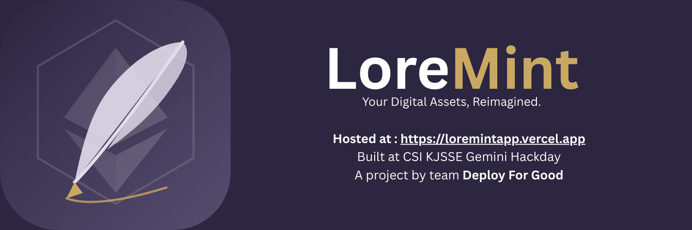

# LoreMint

- Devpost Submission : https://devpost.com/software/loremint-2lf3y1

**LoreMint** is a next-generation NFT analytics and storytelling platform that bridges the gap between on chain data and creative lore. By leveraging **Alchemy's blockchain data** and **generative capabilities of gemini 2.5 and openAI GPT 4**, LoreMint transforms static NFT metadata into immersive narratives while providing deep financial insights.

## Key Features

### Deep NFT Analytics

- **Real-Time Valuation**: Market aware rarity scoring engine that combines trait rarity with floor price context.
- **Harmonic Rarity Algorithm**: Advanced statistical model to identify true gems within collections.
- **Collection Insights**: Detailed stats, floor price trends, and volume data fetched instantly via Alchemy.

### AI-Powered Lore Generation

- **Generative Backstory**: Creates unique, character-driven stories for every NFT based on its specific traits.
- **Trait Explanation**: Contextualizes obscure attributes (e.g., "Why is 'Golden Fur' valuable?").
- **Interactive Storytelling**: Brings static JPEGs to life with rich, immersive text.

- **Seamless Web3 Integration**: Connect with MetaMask/WalletConnect via Wagmi and Viem.

---

## Technology Stack

### Frontend Core
- **Core:** Framework: React 19 (Latest)
- **Build Tool:** Vite
- **Routing:** React Router DOM (v7)
- **Styling:** Plain CSS (with modern variables/gradients) & Framer Motion for animations

### Web3 & Blockchain
- **RainbowKit** (Wallet connection UI)
- **Wagmi & Viem** (Ethereum hooks & replacement for ethers.js)
- **Ethers.js** (Smart contract interaction)
- **Alchemy SDK** Primary data source for NFT metadata, ownership, and collection stats.

### Data Fetching: 
- TanStack Query (React Query)

### Visualization: 
Recharts (for price history/analytics)

### Server: 
Node.js + Express.js

### NFT Data: 
Alchemy SDK
### AI Models:
- OpenAI API
- Google Gemini 2.5 pro

---

## Getting Started

### Prerequisites

- Node.js (v16+)
- npm or yarn
- An [Alchemy API Key](https://alchemy.com/)

### Installation

1. **Clone the repository**

   ```bash
   git clone https://github.com/Arav-Arun/LoreMint.git
   cd LoreMint
   ```

2. **Install dependencies**

   ```bash
   npm install
   ```

3. **Configure Environment Variables**
   Create a `.env` file in the root directory and add your keys:

   ```env
   VITE_ALCHEMY_API_KEY=your_alchemy_api_key
   VITE_GEMINI_API_KEY=your_gemini_api_key
   VITE_WALLETCONNECT_PROJECT_ID=your_walletconnect_id
   ```

4. **Run the Development Server**
   ```bash
   npm run dev
   ```
   Open [http://localhost:5173](http://localhost:5173) to view the app.

---

## Contributing

Contributions are welcome! Please feel free to submit a Pull Request.

1. Fork the Project
2. Create your Feature Branch (`git checkout -b feature/AmazingFeature`)
3. Commit your Changes (`git commit -m 'Add some AmazingFeature'`)
4. Push to the Branch (`git push origin feature/AmazingFeature`)
5. Open a Pull Request

---

Built with ❤️ by Team **Deploy For Good**
